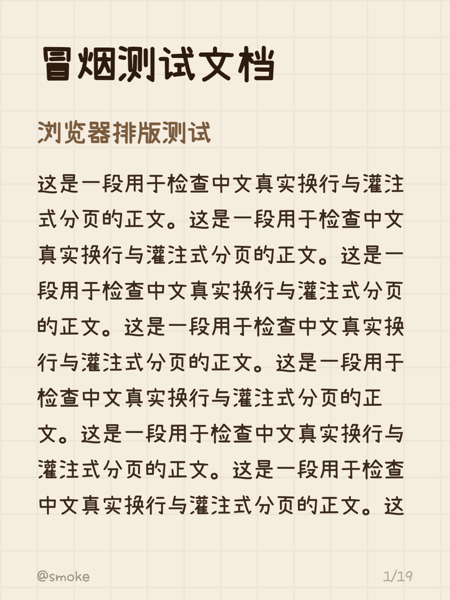

# XHS Longform Exporter

Export an Obsidian Markdown note as a paginated sequence of 1080×1440 PNG
cards for Xiaohongshu. Pagination uses the browser's real text layout, so
Chinese lines, images, tables, and custom fonts are measured before page
breaks are chosen.

把 Obsidian Markdown 长文一键导出为小红书 3:4 图片序列。插件在本地完成解析、
真实字体测量、预览和 PNG 生成，不上传笔记、图片或字体。



## Features

- Uses the note filename as the cover title.
- Renders `#`, `##`, and `###` as three section-heading levels.
- Supports paragraphs, lists, quotes, tables, local images, bold, italic,
  highlight, inline code, and links.
- Keeps text lines and 16:9 images clear of the footer when paginating.
- Pairs consecutive images into a two-column layout.
- Provides minimalist and handwriting styles with nine color palettes.
- Independently scales cover title, section headings, and body text from 80%
  to 110%, useful for keeping a post under Xiaohongshu's image-count limit.
- Downloads three OFL-licensed Chinese handwriting fonts on first use, verifies
  their SHA-256 hashes, and caches them on the current computer.
- Uses PingFang SC and the six PingFang handwriting fonts already installed on a
  computer when available, without copying or modifying their files.
- Imports local TTF, OTF, WOFF, and WOFF2 files without installing them into
  the operating system.

## Requirements

- Obsidian 1.6.6 or later.
- Desktop Obsidian on macOS, Windows, or Linux.

## Installation

### Community plugins

After the plugin is accepted into the Obsidian Community directory:

1. Open **Settings → Community plugins → Browse**.
2. Search for **XHS Longform Exporter**.
3. Select **Install**, then **Enable**.

### Manual installation

Download `main.js`, `manifest.json`, and `styles.css` from the latest GitHub
release. Copy them into `<vault>/.obsidian/plugins/xhs-longform/`, reload
Obsidian, and enable **XHS Longform Exporter** under Community plugins.

## Usage

1. Open a Markdown note.
2. Run **XHS Longform Exporter: Export current note as Xiaohongshu images**
   from the command palette, or right-click the note and choose the export
   command.
3. Enter an account name and choose style, palette, font, texture, and font
   sizes.
4. Select **Preview** to inspect every page.
5. Select **Export PNG**.

The default output directory is:

```text
xhs-export/{{title}}/01.png
xhs-export/{{title}}/02.png
```

## Custom fonts

Open **Settings → XHS Longform Exporter → Import custom font** and choose a
`.ttf`, `.otf`, `.woff`, or `.woff2` file up to 30 MB.

The plugin validates the file, copies it to `.xhs-longform/fonts` in the
current vault, and loads it only for local preview and export. It does not
install the font into the operating system and does not upload it anywhere.
Removing an imported font moves its stored file to the vault trash.

Users are responsible for the license of fonts they import. Importing a font
locally does not cause that font to be distributed with this plugin.

## Fonts and licenses

Locally installed PingFang handwriting fonts are optional system fonts. They
are referenced with CSS `local()` only and are not included, copied, modified,
or redistributed with this plugin. The same applies to PingFang SC. If
PingFang SaTuo is installed, it is the preferred default; otherwise the plugin
offers Xiaolai as the first downloadable font.

The handwriting style includes **Xiaolai Regular / 小赖字体**, **Naikai Light /
内海字体**, and **CEF Fonts CJK Regular / 快去写作业 CJK**. All three are
redistributed under the SIL Open Font License 1.1. They are downloaded from a
version-pinned path in this repository only when selected, checked against a
published SHA-256 hash, and cached in IndexedDB outside the vault. Their license
texts are included in [`assets/fonts`](assets/fonts).

The plugin source code is licensed under MIT. Bundled third-party components
retain their own licenses; see [THIRD_PARTY_NOTICES.md](THIRD_PARTY_NOTICES.md).

## Privacy

The plugin collects no analytics and never uploads notes, images, or imported
fonts. It makes one disclosed network request when an OFL font is first used;
see [PRIVACY.md](PRIVACY.md).

## Support

Report bugs or request features through
[GitHub Issues](https://github.com/zhy9495/obsidian-xhs-longform/issues). For
security issues, follow [SECURITY.md](SECURITY.md).

## Development

```bash
npm install
npm run lint
npm test
npm run build
```

The production build outputs `main.js`. Downloadable WOFF2 files are not
embedded in it, so a release only needs the three standard Obsidian plugin
files.

## Releasing

1. Keep the version identical in `manifest.json` and `package.json`.
2. Add the version-to-minimum-Obsidian mapping to `versions.json`.
3. Run `npm run validate-release`.
4. Push a tag that exactly matches the version, for example `1.0.0` (without a
   `v` prefix).

The release workflow builds and tests the plugin and creates a draft GitHub
release containing `main.js`, `manifest.json`, and `styles.css`.
